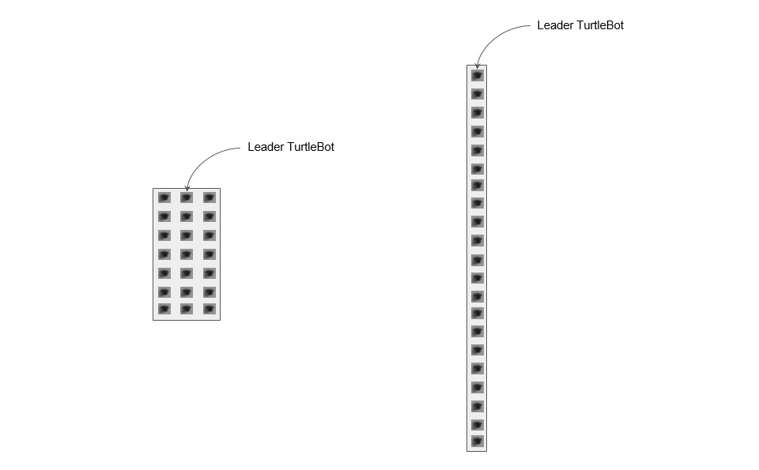
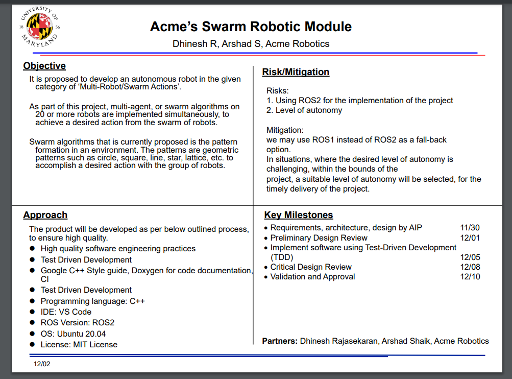

[](https://github.com/stark-2000/Midterm-Project_Group-8/actions/workflows/build_and_coveralls.yml)
[](https://coveralls.io/github/stark-2000/Final-Project_Group-3?branch=main)
[](https://opensource.org/licenses/MIT)
---
# Acme's Autonomous Robot

## Disclaimer
 - License: MIT  
 - License File: LICENSE (in the project directory)
   
## Project Overview and Description:
 - For the final project, me and my teammate have decided to choose multi-robot/swarm action category for Acme’s new line up of autonomous robots. These are developed as part of a 5 year product road map for ACME in developing their fleet of autonomous. We will work on the deliverables and provide a high-quality solution following the essential software engineering practices which they can directly integrate into their product.
 - We will deploy a swarm of 20 turtlebots, which will collectively perform a task of crossing a narrow passage. Their default pattern will be a square or rectangle. 
 - swarm_robot_ros_sim contains packages each of which features a set of functionalities for this simulation platform:

-  swarm_robot_description package describes the robot models and simulation environment initialization files.

-  swarm_robot_msgs folder contains packages for customized messages, services and actions that will be used in other packages.

-  swarm_robot_controller package contains the low level controllers for the swarm robots.

-  swarm_robot_simulation package contains the swarm algorithms.

 


## Purpose of the Project
 - The purpose this project is to deploy simple swarm algorithm on 21 bots to form and deform a pattern in order to navigate a narrow passage. linear curve fitting algorithm be  used to realize the line formation and simulate the project in Gazebo.
 
## Personnel:
 - Dhinesh Rajasekaran 
    - UID: 119400241
 - Arshad Shaik
    - UID: 118438832

## Requirements: 
 - Ubuntu 20.4
 - VS Code/Terminal
 - Gazebo
 - ROS1 noetic
 
## AIP Google Sheet (added iteration 2 & 3)
 - https://docs.google.com/spreadsheets/d/1qG9Fnqy8YEA1hoCkJ37Z2tK7iZklYtnleDhth3kJcko/edit?usp=sharing

## Shareable link to sprint planning notes and review Google Doc (added iteration 2 & 3)
 - https://docs.google.com/document/d/1eRx1KWvxIhgsw_KE1Acz5M6SJKpdceUarCSzpB1HCdQ/edit?usp=sharing
 
## Dependencies
 - doxygen (run below command to install)
   ```
   sudo apt install doxygen
   ```
 - lcov (run below command to install)
   ```
   sudo apt install lcov
   ```
## ROS msg/srv
- Please find 'src' folder of this repository to know more about the messages and services

## Sections for Stubs:
- The test case will subscribe to the topic and check for the expected output

## How to build, run & test from command line
- Navigate to workspace
```
cd ..
catkin_make
cd catkin_ws
source devel/setup.bash
```
```
roslaunch swarm_robot_description two_wheel_robot.launch robot_quantity:=20 half_range:=0.5
rosrun swarm_robot_simulation two_wheel_robot_line_formation _spring_length:=0.7 _sensing_range:=2.0
```
## Test
```
cd catkin_ws
source devel/setup.bash
catkin_make <tests>
``` 

## Command to check Google Style
- From the Final-Project_Group-3 folder src directory, run the below command
```
cpplint --filter=-build/c++11,+build/c++17,-build/namespaces,-build/include_order subscriber.cpp publisher.cpp > ./../results/cpplintreport
```

## Command to run static code analysis
- From the Final-Project_Group-3 folder src directory, run the below command
```
cppcheck --enable=all --std=c++17 *.cpp --suppress=missingIncludeSystem --suppress=missingInclude --suppress=unmatchedSuppression > ./../results/cppcheckreport
```

## Command to generatte doxygen documentation
- Navigate to src directory of each package and execute the following
- all the doxygen documentation is archived in src folder
```
doxygen <cpp file>
cd html
firefox index.html
```

## Demo PPT and Video
- PPT: https://docs.google.com/presentation/d/1S7eiQK_cDZZD_ajEYcy1Xt_sfu_p7t0s/edit?usp=share_link&ouid=110156552288549701398&rtpof=true&sd=true
- Video: https://drive.google.com/drive/folders/1F1mZT1n2O1A1o3VQYphDsl2LwNLuGBbg?usp=share_link

## Quad Chart

 
